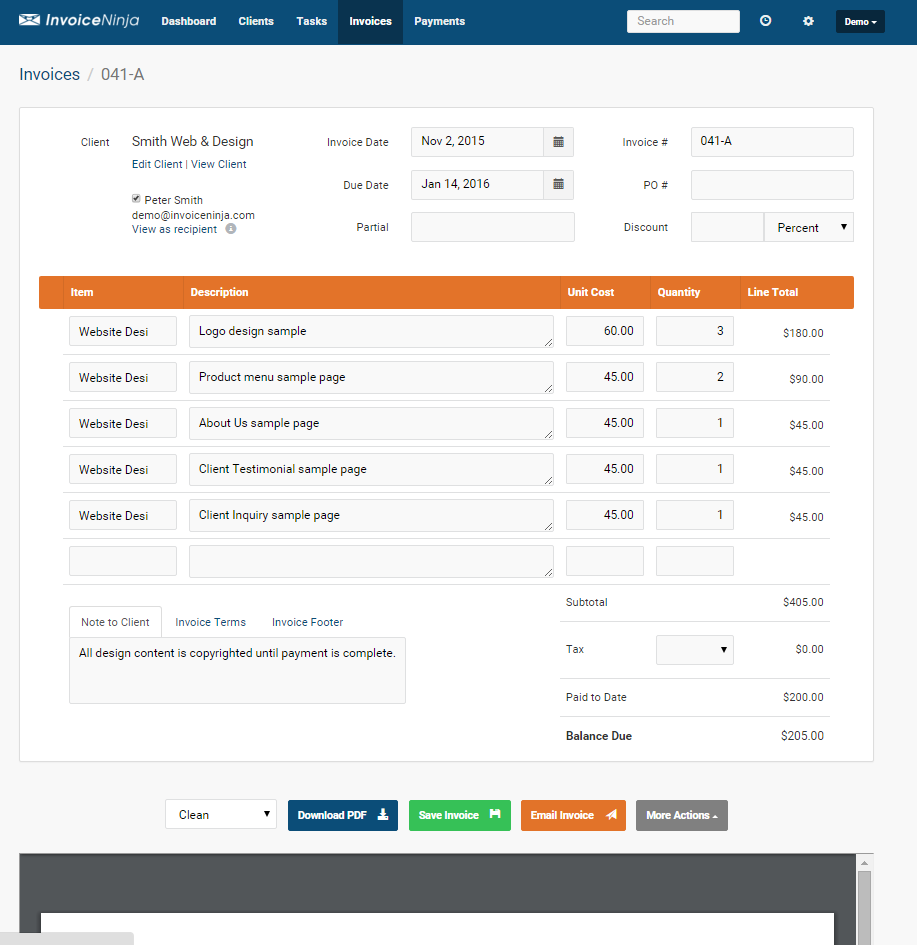

<!--
Важно: этот README был автоматически сгенерирован <https://github.com/YunoHost/apps/tree/master/tools/readme_generator>
Он НЕ ДОЛЖЕН редактироваться вручную.
-->

# InvoiceNinja 5 для YunoHost

[](https://ci-apps.yunohost.org/ci/apps/invoiceninja5/)


[](https://install-app.yunohost.org/?app=invoiceninja5)

*[Прочтите этот README на других языках.](./ALL_README.md)*

> *Этот пакет позволяет Вам установить InvoiceNinja 5 быстро и просто на YunoHost-сервер.*  
> *Если у Вас нет YunoHost, пожалуйста, посмотрите [инструкцию](https://yunohost.org/install), чтобы узнать, как установить его.*

## Обзор

Invoice Ninja is a self-hosted invoicing platform to create & email invoices, track payments and expenses, and time billable tasks & projects for clients.


**Поставляемая версия:** 5.10.61~ynh1

**Демо-версия:** <https://react.invoicing.co/demo>

## Снимки экрана



## Документация и ресурсы

- Официальный веб-сайт приложения: <https://invoiceninja.org>
- Официальная документация пользователя: <https://invoiceninja.github.io/>
- Официальная документация администратора: <https://invoiceninja.github.io/>
- Репозиторий кода главной ветки приложения: <https://github.com/invoiceninja/invoiceninja>
- Магазин YunoHost: <https://apps.yunohost.org/app/invoiceninja5>
- Сообщите об ошибке: <https://github.com/YunoHost-Apps/invoiceninja5_ynh/issues>

## Информация для разработчиков

Пришлите Ваш запрос на слияние в [ветку `testing`](https://github.com/YunoHost-Apps/invoiceninja5_ynh/tree/testing).

Чтобы попробовать ветку `testing`, пожалуйста, сделайте что-то вроде этого:

```bash
sudo yunohost app install https://github.com/YunoHost-Apps/invoiceninja5_ynh/tree/testing --debug
или
sudo yunohost app upgrade invoiceninja5 -u https://github.com/YunoHost-Apps/invoiceninja5_ynh/tree/testing --debug
```

**Больше информации о пакетировании приложений:** <https://yunohost.org/packaging_apps>
